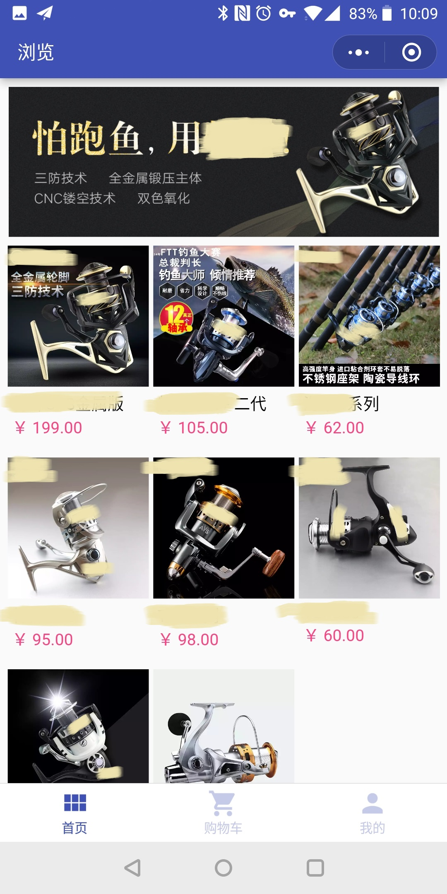

## wx-store-demo

使用 [mpvue](https://github.com/Meituan-Dianping/mpvue) 开发的微信小程序商城。

## 截图

## Change Log

### v1.0.7-fix
- 调整合集标题样式，移动销量位置

### v1.0.7
- 商品详情添加销量和折前价
- 商品详情去掉详情标题
- 商品详情价格字号增加

### v1.0.6
- 增加首页转发
- 增加购物车删除商品

### v1.0.5
- 切换商品页底部按钮，并增加购物车的fab按钮
- 修改商品页底部按钮触发面积
- 为合集图片添加点击链接

### v1.0.4
- 添加立即购买功能
- 调整“提交订单”按钮大小和内容

### v1.0.3
- 去掉前端库存显示

### v1.0.2
- 修复 ios 地址选择拒绝提示不弹出
- 添加显示商品库存

### v1.0.0
- init
